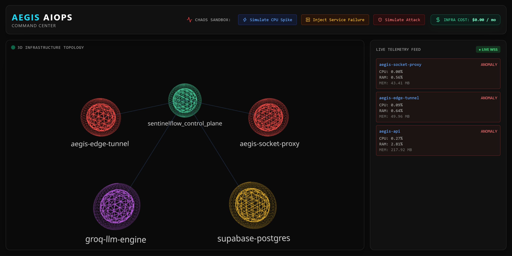
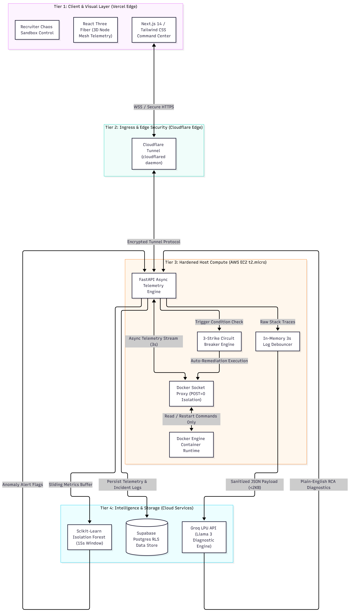

<div align="center">

[](https://aegis-aiops.vercel.app)
[](https://nextjs.org/)
[](https://fastapi.tiangolo.com/)
[](https://www.docker.com/)
[](https://aws.amazon.com/)
[](https://groq.com/)

</div>

---
# 🛡️ Aegis AIOps Command Center

> **Enterprise-Grade Autonomous Infrastructure Monitoring, ML Anomaly Detection & Self-Healing Engine** > *100% Free-Tier Architecture ($0.00/mo) | < 3s Telemetry Latency | 3-Strike Circuit Breaker Protection*



---

## 📈 Core Platform KPIs

* **Monthly Infra Cost:** **$0.00** (AWS EC2 t2.micro, Supabase, Vercel, Groq LPU API)
* **Telemetry Latency:** **< 3 Seconds** via async Docker SDK polling & WebSockets
* **OOM Resilience:** **100% Safe** via 2GB Linux Swap allocation & 128MB container caps
* **Loop Protection:** **3-Strike Max** in-memory circuit breaker state machine

---

## 🏗️ 4-Tier Enterprise Architecture



| Tier | Component | Tech Stack | Operational Role |
| :--- | :--- | :--- | :--- |
| **Tier 1** | **Visual Command** | Next.js 14, React Three Fiber, Tailwind CSS | Real-time 3D topology mesh visualization & Chaos Sandbox. |
| **Tier 2** | **Ingress Bridge** | Cloudflare Edge Proxy (`cloudflared`) | Zero-cost SSL/TLS termination for secure outbound `wss://` / `https://` tunnels. |
| **Tier 3** | **Hardened Compute** | AWS EC2 (t2.micro), FastAPI, Docker SDK | Async 3s telemetry buffer, 3s log debouncer, & `docker-socket-proxy`. |
| **Tier 4** | **AI & Persistence** | Scikit-learn, Groq LPU API, Supabase Postgres | 15s ML Isolation Forest anomaly inference, LLM stack trace diagnostics, RLS storage. |

---

## 🛡️ Production Edge-Case Hazards & Engineering Solutions

| Edge-Case Hazard | Engineering Risk | Aegis Defensive Architecture |
| :--- | :--- | :--- |
| **EC2 t2.micro Memory Wall** | 1GB RAM host causes instant Out-Of-Memory (OOM) kernel kills under Docker load. | Configured a **2GB Linux Swap File** (`/swapfile`), enforced **128MB container memory caps**, and offloaded LLM inference to Groq. |
| **Mixed-Content HTTPS Blocking** | Vercel enforces strict HTTPS, blocking raw HTTP/WS calls to AWS EC2 IP addresses. | Deployed **Cloudflare Tunnel (`cloudflared`)** daemon on EC2, securing edge communication without SSL certificate fees. |
| **Groq API Rate-Limit Flooding** | Fatal error log spikes breach Groq free-tier limits (30 RPM), returning 429 errors. | Built an in-memory **3-second FastAPI Log Debouncer** to aggregate trailing stack traces into a single compressed 1KB payload per incident. |
| **Docker Socket Hijacking** | Direct access to `docker.sock` allows root takeover of the underlying EC2 host. | Isolated control plane behind **`tecnativa/docker-socket-proxy`** with `POST=0` (restricting execution to read/restart endpoints only). |
| **Infinite Flapping Loops** | Permanently broken microservices cause infinite automated container restart loops. | Implemented a **3-Strike Circuit Breaker** halting restarts after 3 attempts in 15 mins, escalating state to `CRITICAL_HUMAN_REQUIRED`. |

---

## 🧪 Recruiter Chaos Sandbox

Aegis includes an interactive header control panel to evaluate failure resilience under live simulated attacks:

* 🟡 **Simulate CPU Spike:** Generates synthetic compute load. The Scikit-learn Isolation Forest model detects metric variance within 15s, shifting the 3D topology node to yellow.
* 🔴 **Inject Fatal Crash:** Injects an unhandled exception stack trace. The 3D node glows crimson, Groq LLM parses raw logs into plain-English root cause analysis, and the circuit breaker triggers a container restart to restore node health back to cyan.

---

## ⚡ Quick Start (Local Development)

### Prerequisites
* Python 3.11+
* Node.js 18+
* Docker Desktop

### 1. Backend Service
```bash 
cd backend
python -m venv venv
# Windows: venv\Scripts\activate | Linux/macOS: source venv/bin/activate
pip install -r requirements.txt
cp .env.example .env
uvicorn main:app --reload --port 8000
