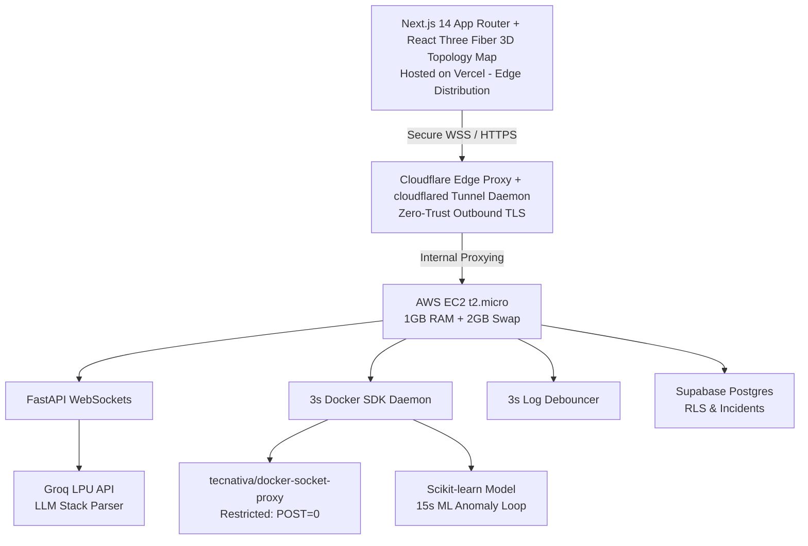

# 1. Problem Statement & Business Impact

## The Enterprise Problem
Modern cloud architectures operating on Kubernetes and microservices suffer from three operational bottlenecks:

1. **Mean Time To Resolution (MTTR) Degradation:** Engineers spend up to 70% of incident response time sifting through thousands of unparsed log lines across fragmented dashboards.
2. **Alert Fatigue & False Positives:** Static threshold alerts (e.g., "CPU > 80%") trigger hundreds of low-priority notifications, leading teams to ignore critical failure signals.
3. **Reactive Firefighting:** Systems crash unannounced because standard tools report metrics after a failure occurs rather than predicting anomalous resource drifts.

## The Business Cost
* **Downtime Cost:** Enterprise outages average $5,600 per minute in lost revenue and SLA breach penalties.
* **Cost Sprawl:** Zombie containers and unoptimized compute silently drain corporate infrastructure budgets.

## The Aegis Solution
Aegis AIOps Command Center is an autonomous, predictive infrastructure platform that detects metric anomalies up to 10 minutes prior to failure, uses LLMs to translate raw crash traces into plain-English root causes, and automatically triggers non-disruptive remediation scripts in real time.

---

# 2. Technical Architecture & Topology Breakdown

The system is engineered using a 4-tier decoupled layout designed for maximum throughput under strict resource limits.

## Component Interaction Flow
1. **Telemetry Collection:** The Python Docker SDK daemon polls container stats every 3 seconds and feeds an in-memory sliding window buffer (`collections.deque(maxlen=100)`).
2. **Dual-Engine Detection:**
   * **Statistical Anomaly:** Scikit-learn Isolation Forest evaluates CPU and RAM trends every 15 seconds.
   * **Crash Exception:** Uncaught stack traces trigger the 3-second Log Debouncer to aggregate raw logs.
3. **LLM Diagnostics:** Sanitized log payloads are transmitted to the Groq LPU API, returning structured JSON containing root cause descriptions and recommended fixes.
4. **Self-Healing Execution:** The circuit breaker validates retry counters and dispatches restart commands to the Docker Socket Proxy.
5. **Real-Time Visual Feedback:** Incident state updates stream via WebSockets to Next.js, turning the target 3D topology node from cyan to pulsating crimson.

---

# 3. Technology Selection & Alternatives Evaluation

| Component | Selected Technology | Rejected Alternative | Engineering Trade-off & Justification |
| :--- | :--- | :--- | :--- |
| **Backend Framework** | **FastAPI (Python)** | Node.js / Express | FastAPI provides native async concurrency (`asyncio`) and direct integration with Python's scientific ecosystem (`scikit-learn`, `numpy`). |
| **LLM Inference** | **Groq LPU API** | Local Ollama / LLaMA 3 | Running local 7B models on AWS EC2 t2.micro requires >4GB VRAM/RAM, causing instant OOM kernel crashes. Groq offloads inference to LPUs with sub-second latency. |
| **Anomaly Engine** | **Scikit-learn Isolation Forest** | Prometheus Thresholds | Static thresholds fail during dynamic traffic shifts. Isolation Forest is an unsupervised algorithm that isolates anomalies without requiring labeled historical data. |
| **Ingress & SSL** | **Cloudflare Tunnel** | AWS ALB + Custom Domain | AWS Application Load Balancers cost ~$16/month plus domain fees. `cloudflared` provides free outbound TLS termination and bypasses incoming security group configurations. |
| **3D Rendering** | **React Three Fiber** | Standard Chart.js / Recharts | R3F allows 3D spatial representation of complex service meshes, making state changes visually actionable for engineering directors. |
| **State Persistence** | **Supabase Postgres** | Self-Hosted MongoDB | Self-hosted databases consume significant host RAM. Supabase provides managed Postgres with Row Level Security (RLS) over REST/WebSocket APIs. |

---

# 4. Scalability & System Evolution Blueprint

## Current Architecture (1x Scale — 1 Host / 15 Microservices)
* **Compute:** 1 AWS EC2 t2.micro instance (1 vCPU, 1 GB RAM + 2 GB Linux Swap).
* **In-Memory Buffer:** `collections.deque(maxlen=100)` storing raw metrics locally.
* **Bottleneck:** Host CPU saturation and single-point-of-failure Docker daemon polling.

## 10× Scaling Architecture (100–500 Microservices)
* **Telemetry Decoupling:** Replace local Docker SDK thread with lightweight **FluentBit** or **Vector** sidecar agents forwarding metrics to an **Apache Kafka** or **AWS SQS** queue.
* **Compute Expansion:** Migrate FastAPI to **AWS ECS Fargate** with auto-scaling tasks triggered by target tracking policies (CPU > 70%).
* **WebSocket Fanout:** Introduce a **Redis Pub/Sub** layer to decouple backend ingestion from client WebSocket connections, allowing multiple stateless API nodes.

## 100× Scaling Architecture (5,000+ Microservices / Multi-Region)
* **Kernel-Level Telemetry:** Replace user-space container polling with **eBPF (Cilium / Pixie)** programs running inside the Linux kernel to capture network, CPU, and memory events with <0.1% overhead.
* **Storage Tiering:** Route raw high-frequency telemetry into **ClickHouse** (columnar time-series store) for low-latency analytics, retaining only aggregated incident logs in Postgres.
* **Self-Hosted Inference:** Deploy fine-tuned SLMs (e.g., Phi-3-Mini or Qwen-2.5-Coder) on dedicated **vLLM / Kubernetes GPU clusters** with fallback to Groq/Anthropic APIs during traffic spikes.