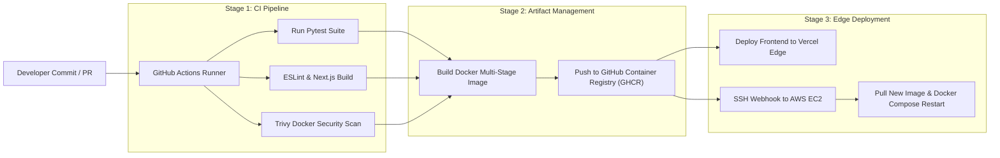
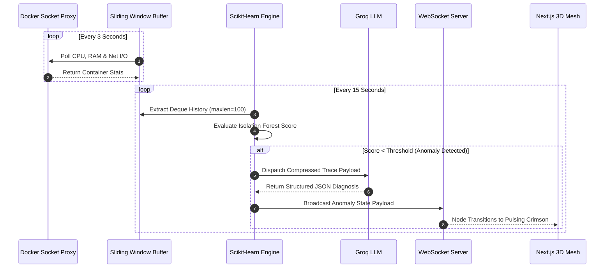

# CI/CD Pipeline Architecture & Telemetry Engine

## 1. CI/CD Deployment Workflow

Aegis uses automated GitHub Actions workflows to validate unit tests, scan container security vulnerabilities, and trigger blue/green edge updates upon commits to `main`.

---

## 2. Telemetry, Health Polling & Monitoring Matrix

The platform collects runtime container statistics every 3 seconds via the Docker Socket, buffering metrics locally before running anomaly detection loops.

---

## 3. Monitoring Metrics & SLA Targets

| Target Component | Metric Tracked | Sampling Interval | Anomaly Trigger Threshold | Target SLA / Bound |
| :--- | :--- | :--- | :--- | :--- |
| **FastAPI Backend** | P99 Endpoint Latency | Continuous | > 250 ms over 3 consecutive calls | 99.9% Uptime |
| **Docker Microservices** | RAM Utilization % | 3 Seconds | > 85% sustained for 30s | Memory Cap = 128MB |
| **EC2 Host** | Swap Memory Usage | 10 Seconds | > 80% total swap capacity | Max 2 GB Swap |
| **Isolation Forest ML** | Outlier Anomaly Score | 15 Seconds | Decision Score < -0.15 | Zero False Positives |
| **Groq LLM Pipeline** | Token Ingestion Latency | Event-Driven | > 1.2 Seconds | < 800 ms response time |
| **WebSocket Connection** | Heartbeat Ping/Pong | 5 Seconds | Disconnect > 10 Seconds | Auto-reconnect < 1s |