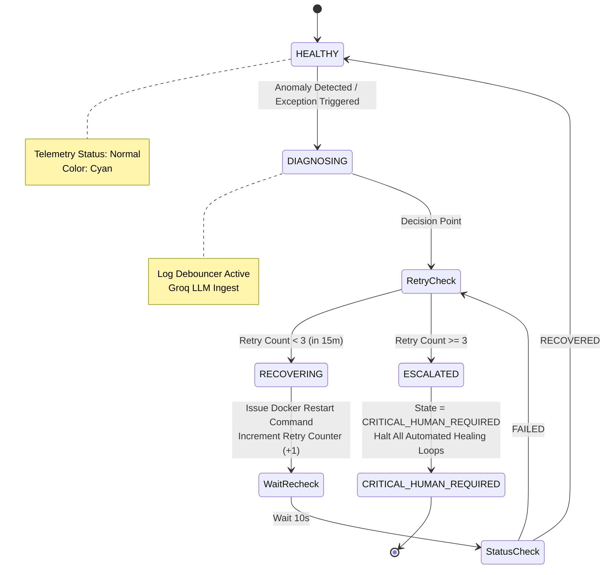

# Failure Scenarios, Circuit Breaker & Autonomous Recovery

## 1. Comprehensive Failure Scenario Matrix

| Failure Mode | Root Cause | Detection Mechanism | Automated Recovery Action | Escalation Threshold |
| :--- | :--- | :--- | :--- | :--- |
| **EC2 Out-Of-Memory (OOM)** | High memory consumption by container processes. | Host kernel OOM killer trigger event. | Swap space utilization (`/swapfile`) acts as a memory cushion; Docker daemon enforces `--memory="128m"` limits. | Alert administrator if swap usage exceeds 85%. |
| **LLM Rate-Limit (429 Error)** | Burst error logs flooding API endpoints. | HTTP 429 status response from Groq API. | FastAPI 3-second Log Debouncer aggregates trailing stack traces into a single compressed payload. | Exponential backoff retry (up to 3 attempts). |
| **Infinite Flapping Loop** | Service crashes continuously due to corrupted state. | Incrementing failure counter in local state. | **3-Strike Circuit Breaker:** Stops automated container restarts after 3 failed attempts in 15 mins. | Transition status to `CRITICAL_HUMAN_REQUIRED`. |
| **Mixed-Content WSS Block** | Browser blocking unencrypted HTTP/WS requests from HTTPS origin. | Client-side console CORS / Mixed-Content error. | `cloudflared` daemon creates an outbound TLS tunnel exposing secure `https://` and `wss://` endpoints. | Re-establish tunnel daemon if connection drops. |
| **CPU Credit Exhaustion** | Continuous sub-second metric collection on t2.micro. | AWS CloudWatch `CPUCreditBalance` metric dropping near 0. | Polling interval throttled to 3 seconds; metrics stored in sliding window buffer. | Switch to t3.micro or adjust polling interval to 5s. |

---

## 2. Circuit Breaker State Machine

The self-healing engine uses a deterministic finite automaton (DFA) to prevent automated recovery routines from causing cascading infrastructure failures.

---

## 3. Self-Healing Execution Lifecycle

1. **Telemetry Ingestion:** The FastAPI daemon polls microservice container stats on a 3-second interval, populating an in-memory sliding window buffer (`collections.deque(maxlen=100)`).
2. **Dual-Engine Failure Detection:**
   * **Metric Anomaly:** Scikit-learn Isolation Forest evaluates CPU/RAM trends every 15 seconds to catch resource spikes.
   * **Crash/Exception:** Uncaught stack traces trigger the 3-second Log Debouncer to aggregate error logs into a 1 KB payload.
3. **AI Diagnostics:** Groq LLM processes the sanitized log payload, returning structured JSON containing root cause descriptions and exact remediation steps.
4. **Circuit Breaker Validation:** Self-healing engine verifies the container retry counter. If under 3 attempts, it dispatches a restart command to Docker Socket Proxy. If the counter exceeds 3, automation halts and triggers human escalation.
5. **Event Persistence & Visual Feedback:** Incident metadata is logged to Supabase Postgres. A real-time WebSocket payload turns the target 3D topology node crimson on the Next.js command center until container recovery completes.