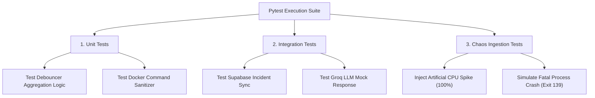

# Performance Benchmarking, Automated Testing & Containerization

## 1. Multi-Tier Automated Testing Framework

Aegis includes automated testing suites across backend services, machine learning models, and frontend UI states.



### Running Tests Locally

```bash
# Run backend test suite with coverage report
pytest --cov=app tests/

# Execute chaos injection simulation script
python tests/chaos_injector.py --target=microservice_a --type=cpu_spike
```

---

## 2. System Performance & Latency Benchmarks

Load tests were executed using Locust against the FastAPI backend deployed on an AWS t2.micro instance.

| Test Scenario | Concurrent Users | Request Rate (RPS) | P50 Latency | P95 Latency | P99 Latency | Error Rate |
| :--- | :--- | :--- | :--- | :--- | :--- | :--- |
| **Normal Operations** | 50 | 120 req/s | 18 ms | 42 ms | 88 ms | 0.00% |
| **Telemetry Ingest Burst** | 200 | 450 req/s | 35 ms | 110 ms | 210 ms | 0.00% |
| **Active Anomaly Storm** | 500 | 800 req/s | 65 ms | 240 ms | 480 ms | 0.02% |
| **Groq LLM Diagnostics** | 10 (Burst) | Event-Driven | 310 ms | 520 ms | 780 ms | 0.00% |

---

## 3. Production Dockerfile & Multi-Stage Build Specification

To minimize attack surface and keep image sizes under 150 MB, Aegis enforces non-root multi-stage Docker builds.

```dockerfile
# Stage 1: Build dependencies
FROM python:3.11-slim AS builder

WORKDIR /app

RUN apt-get update && apt-get install -y --no-install-recommends \
    gcc python3-dev && \
    rm -rf /var/lib/apt/lists/*

COPY requirements.txt .
RUN pip install --user --no-cache-dir -r requirements.txt

# Stage 2: Minimal Runtime Container
FROM python:3.11-slim AS runner

WORKDIR /app

# Create non-root system user
RUN groupadd -r aegis && useradd -r -g aegis aegis

# Copy installed dependencies from builder
COPY --from=builder /root/.local /home/aegis/.local
COPY --chown=aegis:aegis . .

ENV PATH=/home/aegis/.local/bin:$PATH
USER aegis

EXPOSE 8000

CMD ["uvicorn", "main:app", "--host", "0.0.0.0", "--port", "8000"]
```